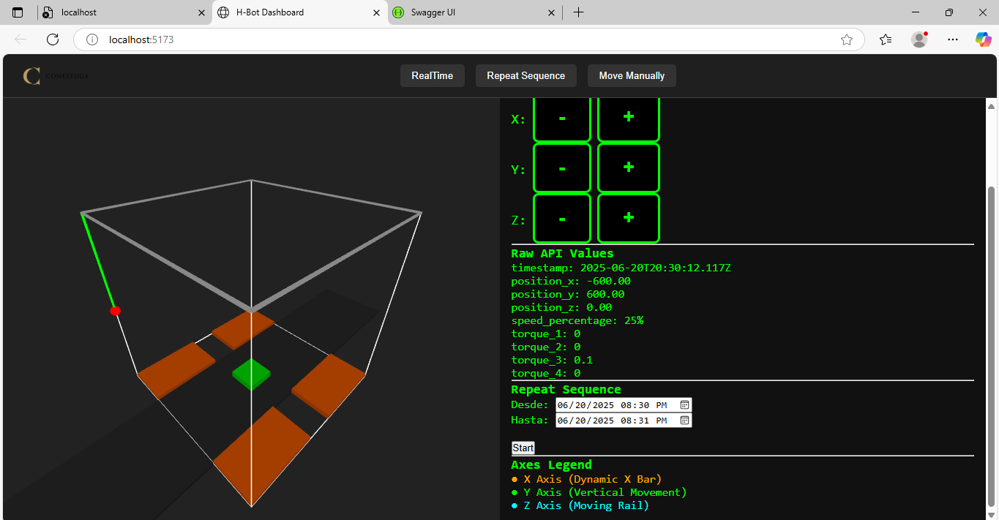
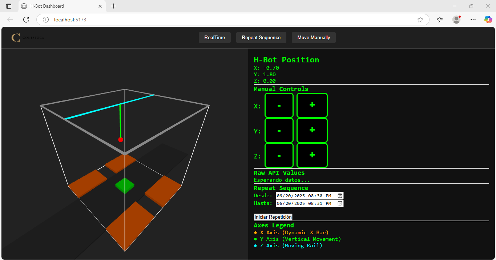

# HBot 3D Dashboard

This dashboard was developed using the threejs library for create 3D animation, and is intended to use two API's for obtain data from the database about the status of the robot.

## Features
- Connects to the database using MS3 apis
- 3 work modes (RealTime, Repeat and Manual)

## Operation mode

3 operation modes are available.  

### RealTime
In this mode, the robot will use the api __robot/latest__ to get the last data of the robot and the movement will be reflected in the robot simulation. Basically, it works as a digital twin of the real robot. For using this mode we recommend publish position in a highest frequency, 100 to 300 ms the movement simulation will show smooth transitions 



### Repeat
In the repeat mode, you will be able to choose a period of time and the robot will repeat this specific period, you will see everything that the robots did in this period. For this case will use the api __/robots?from=2025-06-20T20:30:00Z&to=2025-06-20T20:31:00Z&robot_name=HBOT__


### Manual
This mode is just a simulation, you can move manually the 3 axis of the robots, but this will no affect the real robot, it is just showing the simulation in the virtual model, this could be used for calculations needed when the robot is being programed. 




## Required APIs

### Latest status
This API will give you the last updated status of the robot.

    /robots/latest/HBOT


```bash
http://localhost:3000/robots/latest/HBOT
```

The response for this, will be the following JSON

```json
{
  "id": 133784,
  "version": "1.0.0",
  "timestamp": "2025-06-23T16:03:15.033Z",
  "robot_name": "HBOT",
  "is_initialized": false,
  "is_running": false,
  "is_paused": false,
  "has_violation": false,
  "position_x": 176.2543,
  "position_y": 206.382,
  "position_z": 0,
  "position_w": 0,
  "speed_percentage": 25,
  "torque_1": -1.4,
  "torque_2": 6.1,
  "torque_3": -7.2,
  "torque_4": 0
}
```

### Historical Data
This API will give you the historical data in a specific period of time. 

```bash
/robots?from=2025-06-20T20:30:00Z&to=2025-06-20T20:31:00Z&robot_name=HBOT
```
## Project Structure

- public
  - assets
- src
  - functions
    - functions.ts
  - modes
    - manual.ts
    - realtime.ts
    - repeat.ts
  - scene
    - hbotScene.ts
  - main.ts
- env.example
- Dockerfile
- docker-compose.yml
- README.md

## Getting Started

To run this microservice locally, connect to the IoT network and create a .env file with the required configuration based on your apis endpoint.


### 1. Clone the Repository

```bash
git clone https://github.com/conestogateam2/iot_team2.git

cd hbot-dashboard
```

### 2. Connect to the IoT Network
Ensure your computer is connected to the IoT network and that you can reach the MQTT broker and Database. 

### 3. .env Configuration
Create a .env file in the root directory with the following structure:

1. Update your credentials
2. Update your topic


```bash
HOST=localhost
BACKEND_PORT=4000
```

### 4. Run!

```bash
##Just first time
npm install
npm install typescript

## Run!
npm run dev
```

Once that the service is running, you will be able to see the dashboard in:

http://localhost:5173/


## Authors 
- Juan Jimenez
- Magnus Eriksson
- Vitor Medeiros
- Yuvrajsinh Adajania


